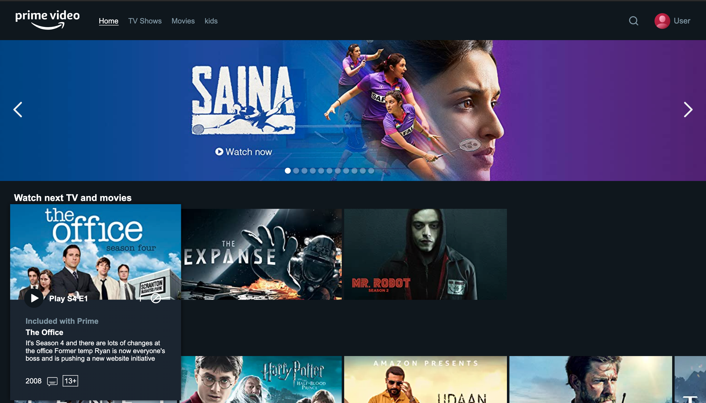
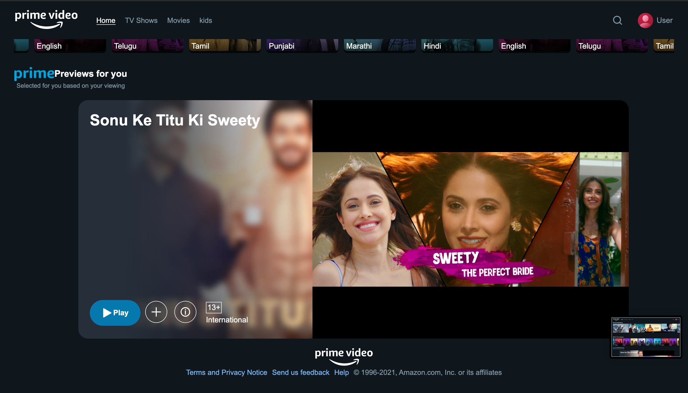

# Prime Video clone (only frontend) (React and CSS)

<h1 align="center">Built With</h1>
<p align="center">
 <a href="https://www.w3schools.com/css/" target="_blank">  </a> <a href="https://reactjs.org/" target="_blank">  </a>
</p>

## Requirements
First clone your project and run the command in your command product
###### remember to navigate to the project folder in order to avoid the errors
```sh
npm install
```
## How to Proceed
* To Clone the repo run the command given below:
```sh 
git clone https://github.com/Arun89-crypto/Prime-Video-Clone.git
```
* Run this command after cloning and storing the project in your system
```sh 
npm install
npm start
```

## Screenshots of Project
<p align="center">
  </img>
  </img>
  </img>
</p>
